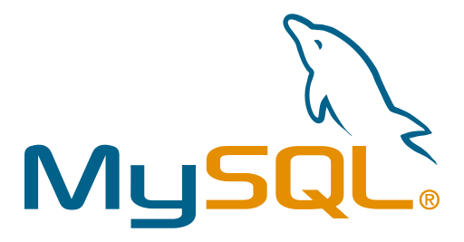

# Fadi Hania

<!-- ## Full-Stack Web Developer -->
[][coddict]

[][linkedin]

Experienced Full-Stack Web Developer, Consultant, Mentor and Trainer with MSc Software Engineering. Written first line of code in 1999, hence have in-depth development experience in which I have worked on developing many successful projects, while helping thousands in learning software development.

### Connect with me:

[][coddict]
[][coddict]
[][twitter]
[][linkedin]
[][paypal]
[][patreon]
[][skype]

 
 

## Skills
### Languages:

[][linkedin]
[][linkedin]
[][linkedin]
[][linkedin]
[][linkedin]
[][linkedin]
[][linkedin]

 

### Frontend:
[][linkedin]
[][linkedin]
[][linkedin]
[][linkedin]

 

### Backend:
[][linkedin]
[][linkedin]
[][linkedin]
[][linkedin]
[][linkedin]

 

### Database:
[][linkedin]
[][linkedin]
[][linkedin]
[][linkedin]

 

### Tools:
[][linkedin]
[][linkedin]
[][linkedin]
[][linkedin]
[][linkedin]
[][linkedin]
[][linkedin]

[coddict]: https://coddict.co
[youtube]: https://www.youtube.com/channel/UCfzYWnY6NI5JI9SlGl6NNuA
[linkedin]: https://linkedin.com/in/fadihania
[twitter]: https://twitter.com/fadihania
[skype]: https://join.skype.com/invite/aOv2PHNvzmWc
[paypal]: https://paypal.me/coddict
[patreon]: https://www.patreon.com/coddict

